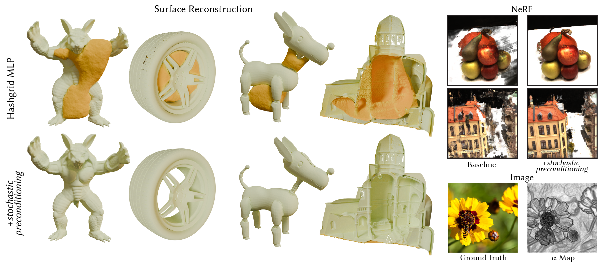

# Stochastic Preconditioning for Neural Field Optimization [Siggraph 2025]


### [Project Page](https://research.nvidia.com/labs/toronto-ai/stochastic-preconditioning/) | [Paper](https://arxiv.org/abs/2006.09661) 

[Selena Ling](https://iszihan.github.io/),
[Merlin Nimier-David](https://merlin.nimierdavid.fr/),
[Alec Jacobson](https://www.cs.toronto.edu/~jacobson/),
[Nicholas Sharp](https://nmwsharp.com/)<br>
ACM Transaction on Graphics (Proceedings of SIGGRAPH North America 2025)

Stochastic preconditioning adds spatial noise to query locations during neural field optimization; it can be formalized as a stochastic estimate for a blur operator. This simple technique eases optimization and significantly improves quality for neural fields optimization, matching or outperforming custom-designed policies and coarse-to-fine schemes.

## Get started
You can set up a conda environment with all dependencies like so:
```
conda create --name stcp python=3.8
conda activate stcp
python -m pip install --upgrade pip
pip install torch==1.12.1+cu113 torchvision==0.13.1+cu113 -f https://download.pytorch.org/whl/torch_stable.html
pip install git+https://github.com/NVlabs/tiny-cuda-nn/#subdirectory=bindings/torch
pip install -r requirements.txt
```
## Adding stochastic preconditioning to your training code is easy! 
TODO

## SDF from Oriented Point Cloud Experiment
We provide code for the SDF fitting from Oriented Point Cloud experiment as described in Section 5.1.1.

For this experiment, we show benefits with a variety of neural field representations:

### Hash Grid Encoding 
Run `train_hashgrid.sh` for training with hash grid encoding without and with stochastic preconditioning.
### Fourier Feature Encoding 
Run `train_fourier.sh` for training with fourier feature encoding without and with stochastic preconditioning:
### Triplane-based Feature Encoding 
Run `train_pet.sh` for training with [triplane-based feature encoding](https://github.com/yiqun-wang/PET-NeuS) without and with stochastic preconditioning:
### Sinusoidal INR ([FINER](https://arxiv.org/abs/2312.02434))
Run `train_finer.sh` for training with FINER network without and with stochastic preconditioning.

## Mesh Extraction
The training scripts above always extract a mesh at the end of training. One can also run the following script to extract a mesh from a specified checkpoint: 
```
python experiment_scripts/test_sdf.py --checkpoint_path './logs/EXPNAME/checkpoints/CKPTNAME.pth' --experiment_name EXPNAME --out_name OUTPUTNAME
```

## Credits 
This repo is built from existing codes from [Siren](https://github.com/vsitzmann/siren), [SDFStudio](https://github.com/autonomousvision/sdfstudio), [PET-NeuS](https://github.com/yiqun-wang/PET-NeuS) and [FINER](https://github.com/liuzhen0212/FINER). We thank the maintainers for their contribution to the community!

<!-- ## Citation
If you find our work useful in your research, please cite:
```
@inproceedings{sitzmann2019siren,
    author = {Sitzmann, Vincent
              and Martel, Julien N.P.
              and Bergman, Alexander W.
              and Lindell, David B.
              and Wetzstein, Gordon},
    title = {Implicit Neural Representations
              with Periodic Activation Functions},
    booktitle = {arXiv},
    year={2020}
}
``` -->

## Contact
If you have any questions, please feel free to email the authors.
